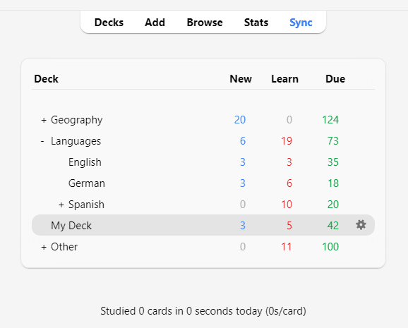
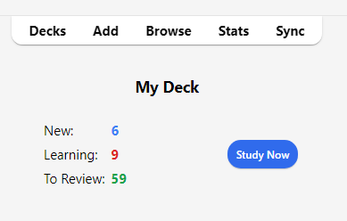

# 学習

<!-- toc -->

気に入ったデッキを見つけたり、ノートを入力したりしたら、学習を始める時間です。

## デッキ

Ankiでの学習は、現在選択されているデッキとそれに含まれるサブデッキに限定されます。

デッキ画面では、デッキとサブデッキがリストで表示されます。その日の[新規、学習中、復習期限](getting-started.md#card-states)カードもここに表示されます。

デッキをクリックすると、それが「現在のデッキ」になり、Ankiは学習画面に切り替わります。
メインウィンドウの上部にある「デッキ」をクリックすることで、いつでもデッキリストに戻ることができます。
（メニューの「デッキを学習」アクションを使用してキーボードから新しいデッキを選択したり、<kbd>s</kbd>キーを押して現在選択されているデッキを学習したりすることもできます。）

デッキの右側にある歯車ボタンをクリックして、デッキの名前を変更したり削除したり、[オプション](deck-options.md)を変更したり、[エクスポート](exporting.md)したりできます。

## 学習概要

学習するデッキをクリックした後、今日復習期限のカードが何枚あるかを示す画面が表示されます。これは「デッキ概要」画面と呼ばれます：

カードは[3つのタイプ](getting-started.md#card-states)に分かれています：新規、学習中、復習です。
デッキオプションで[兄弟カードを保留](#siblings-and-burying)を有効にしている場合、
保留されるカードの数が灰色で表示されることがあります：

学習セッションを開始するには、**今すぐ学習**ボタンをクリックします。Ankiは、その日に表示すべきカードがなくなるまでカードを表示し続けます。

学習中は、キーボードの<kbd>s</kbd>キーを押すことで概要に戻ることができます。

## 質問

カードが表示されると、最初は質問のみが表示されます。答えを考えた後、**答えを表示**ボタンをクリックするか、スペースバーを押します。そうすると答えが表示されます。答えを思い出すのに少し時間がかかっても構いませんが、一般的なルールとして、約10秒以内に答えられない場合は、思い出そうと苦労し続けるよりも、先に進んで答えを表示する方が良いでしょう。

## 回答ボタン

答えが表示された後、考えた答えと表示された答えを比較し、以下のボタンのいずれかを選択します。

- **もう一度**: 答えが間違っているか、答えを思い出せなかったときに選択します。答えが部分的に正しい場合でも、厳しく判断すべきです：Anki外の実生活で失敗とみなされる場合は、Ankiでも失敗とみなします。通常、このボタンは約5-20%の頻度で使用します。

  キーボードショートカット: <kbd>1</kbd>

- **難しい**: 答えは正しいが、疑いがあったり思い出すのに長い時間がかかったときに選択します。

  キーボードショートカット: <kbd>2</kbd>

- **普通**: 答えは正しいが、思い出すのに精神的な努力が必要だったときに選択します。Ankiを適切に使用している場合、これが最もよく使用されるボタンになるはずです。通常、このボタンは約80-95%の頻度で使用します。

  キーボードショートカット: <kbd>3</kbd>、<kbd>Space</kbd>、<kbd>Enter</kbd>

- **簡単**: 答えが正しく、思い出すのに精神的な努力が不要だった場合に選択します。

  キーボードショートカット: <kbd>4</kbd>

4つの回答ボタンを使うのが難しい場合は、**もう一度**と**普通**のボタンのみを使用することもできます。間違った答えには**もう一度**を使用し、正しい答えには**普通**を使用します。

各回答ボタンには、そのボタンを選択した場合に次にカードが再度復習される時期が表示されます。次の復習間隔を制御する設定について学ぶには、デッキオプションセクションの[学習ステップ](deck-options.html#learning-steps)、[忘却](deck-options.md#lapses)、[FSRS](deck-options.html#fsrs)、[詳細設定](deck-options.md#advanced)のトピックをご覧ください。

## ファズファクター

復習カードで回答ボタンを選択すると、Ankiは同時に導入され同じ評価を受けたカードが
くっついて常に同じ日に復習に現れることを防ぐため、少量のランダムな「ファズ」も適用します。

学習カードには、常に同じ順序で表示されないように最大5分の追加遅延も与えられますが、
回答ボタンにはそれが反映されません。この機能をオフにすることはできません。

## 編集とその他

左下の**編集**ボタンをクリックして、現在のノートを編集できます。編集が終わると、学習に戻ります。編集画面は[ノートの追加](editing.md)画面と非常によく似た動作をします。

学習画面の右下には**その他**というラベルの付いたボタンがあります。
このボタンは、現在のカードまたはノートに対して実行できる他の操作を提供します：

- [**カードにフラグを付ける**](editing.md#using-flags): カードに色付きマーカーを追加したり、オフに切り替えたりします。フラグは学習中に表示され、ブラウザ画面でフラグ付きカードを検索できます。これは、家に帰ったときに単語を調べるなど、後でカードに対して何らかのアクションを取りたいときに便利です。Anki 2.1.45以降を使用している場合は、[ブラウザ](browsing.md)からフラグの名前を変更することもできます。

- **カード/ノートを保留**: カードまたはノートのすべてのカードを翌日まで復習から隠します。
  （それより前にカードの保留を解除したい場合は、[デッキ概要](studying.md#study-overview)画面の「保留解除」ボタンをクリックできます。）これは、現時点でカードに答えられない場合や、別の時に戻ってきたい場合に便利です。保留は、同じノートのカードに対して[自動的に発生](studying.md#siblings-and-burying)することもあります。

- **カードをリセット**: 現在のカードを[新規キューの最後](browsing.md#cards)に移動します。

  「元の位置を復元」オプションを使用すると、リセット時にカードを元の位置に戻すことができます。

  「反復回数と忘却回数をリセット」オプションを有効にすると、カードの復習回数と失敗回数が
  ゼロに戻ります。カード情報画面の下部に表示される復習履歴は削除されません。

- **期限日を設定**: カードを復習キューに入れ、[特定の日付に期限を設定します。](browsing.md#cards)

- **カード/ノートを保留停止**: カードまたはノートのすべてのカードを、手動で保留停止が解除されるまで（ブラウザで保留停止ボタンをクリックすることで）復習から隠します。
  これは、しばらくの間ノートの復習を避けたいが、削除したくない場合に便利です。

- **オプション**: 現在のデッキの[オプション](deck-options.md)を編集します。

- **カード情報**: カードに関する[統計情報](stats.md#card-info)を表示します。

- **前のカード情報**: 前のカードに関する[統計情報](stats.md#card-info)を表示します。

- [**ノートにマークを付ける**](editing.md#the-marked-tag): 現在のノートに「marked」タグを追加し、ブラウザで簡単に見つけられるようにします。これは個々のカードにフラグを付けるのと似ていますが、代わりにタグで動作するため、ノートに複数のカードがある場合、マークされたタグの検索ですべてのカードが表示されます。ほとんどのユーザーは代わりにフラグを使用したいと思うでしょう。

- **コピーを作成**: 現在のノートの[複製](browsing.md#finding-duplicates)をエディターで開き、カードのバリエーションを簡単に取得するために少し変更できます。
  デフォルトでは、複製カードは元のカードと同じデッキに作成されます。

- **ノートを削除**: ノートとそのすべてのカードを削除します。

- **音声を再生**: カードの表または裏に音声がある場合、もう一度再生します。

- **音声を一時停止**: 再生中の音声を一時停止します。

- **音声 -5秒 / +5秒**: 現在再生中の音声で5秒後方/前方にジャンプします。

- **自分の声を録音**: 発音をチェックする目的でマイクから録音します。この録音は一時的なもので、次のカードに移動すると消えます。カードに恒久的に音声を追加したい場合は、編集ウィンドウで行うことができます。

- **自分の声を再生**: 前回の自分の声の録音を再生します（おそらく答えを表示した後）。

## 表示順序

学習では、選択したデッキとそれに含まれるデッキからカードが表示されます。
したがって、「フランス語」デッキを選択すると、サブデッキ「フランス語::語彙」と「フランス語::私の教科書::レッスン1」も表示されます。

デフォルトでは、新しいカードの場合、Ankiはアルファベット順でデッキからカードを収集します。
上記の例では、最初に「フランス語」、次に「私の教科書」、最後に「語彙」からカードを取得します。
これを使用してカードが表示される順序を制御でき、優先度の高いカードをリストの上位に表示されるデッキに配置できます。
コンピューターがテキストをアルファベット順にソートするとき、「-」文字はアルファベット文字の前に来て、「~」はその後に来ます。
したがって、デッキを「-語彙」と呼んで最初に表示させたり、他のデッキを「~私の教科書」と呼んで他のすべての後に強制的に表示させたりできます。

新しいカードと復習は別々に収集され、Ankiは両方のキューが空になるまで次のデッキに移動するのを待たないため、
あるデッキから新しいカードを見ながら、別のデッキから復習を見ることがあります。その逆もあります。
これを望まない場合は、親デッキの1つではなく、学習したいデッキを直接クリックしてください。

学習中のカードはある程度時間に敏感なため、すべてのデッキから一度に取得され、期限順に表示されます。

カードが表示される順序を制御するには、[表示順序](./deck-options.md#display-order)を参照してください。新しいカードのより細かい順序については、[ブラウザ](browsing.md)で順序を変更できます。

## 兄弟カードと保留

[基本](getting-started.md)から、Ankiは入力した1つのものに対して複数のカードを作成できることを思い出してください。たとえば、表→裏カードと裏→表カード、または同じテキストからの2つの異なる穴埋め削除などです。
これらの関連カードは「兄弟」と呼ばれます。

兄弟を持つカードに答えると、Ankiは自動的に「保留」することで、カードの兄弟が同じセッションで表示されないようにできます。
保留されたカードは、時計が新しい日に切り替わるか、[デッキ概要](studying.md#study-overview)画面の下部に表示される「保留解除」ボタンを使用して手動で保留を解除するまで、復習から隠されます。
Ankiは、兄弟が同じデッキにない場合でも（たとえば、[デッキオーバーライド](templates/intro.md)機能を使用する場合）、兄弟を保留します。

[デッキオプション](deck-options.md)画面から保留を有効にできます。新しいカードと復習用に個別の設定があります。

Ankiは新規または復習カードである兄弟のみを保留します。学習中のカードは隠しません。それらのカードには時間が重要だからです。
一方、学習カードを学習するとき、新規/復習の兄弟は保留されます。

また、カードは同時に保留と保留停止することはできません。保留されたカードを保留停止すると、保留が解除されます。保留停止されたカードは保留できません。

## キーボードショートカット

Ankiの一般的な操作のほとんどにはキーボードショートカットがあります。それらのほとんどはインターフェースで発見できます：メニュー項目の横にショートカットが表示され、ボタンの上にマウスカーソルを置くと、通常はツールチップにショートカットが表示されます。

学習中は、<kbd>Space</kbd>または<kbd>Enter</kbd>で答えを表示します。答えが表示されたら、<kbd>Space</kbd>または<kbd>Enter</kbd>を使用して「普通」ボタンを選択できます。
<kbd>1</kbd>-<kbd>4</kbd>キーを使用して特定の難易度ボタンを選択できます。多くの人は、ほとんどのカードに<kbd>Space</kbd>で答え、忘れたときのために<kbd>1</kbd>に指を置いておくと便利だと感じています。

ツールメニューの「デッキを学習」項目を使用すると、キーボードですばやくデッキに切り替えることができます。<kbd>/</kbd>キーでトリガーできます。
開くと、すべてのデッキが表示され、上部にフィルター領域が表示されます。
文字を入力すると、Ankiは入力した文字に一致するデッキのみを表示します。
スペースを追加して複数の検索語を区切ることができ、Ankiはすべての語に一致するデッキのみを表示します。
したがって、「ja 1」または「on1 ja」は両方とも「日本語::レッスン1」というデッキに一致します。

## 遅れをとる

復習に遅れをとると、Ankiはデフォルトで最も長く待っているカードを優先します。
この順序により、カードが無期限に待たされることはありませんが、新しいカードを導入すると、
バックログを処理するまでその復習は表示されないことを意味します。

しばらく待っていたカードに答えると、Ankiは次にカードを表示すべき時期を決定する際にその遅延を考慮します。
これは、長い休憩の後にAnkiに戻る場合、最初からやり直す必要がなく、中断したところから始めることができることを意味します。

## 表示順序

Ankiがレビューおよび新規カードの表示順序を決定する方法を理解することは、望ましい動作を微調整するのに役立ちます。簡単に言えば、Anki：

- カードを収集するときは、一度に1つのデッキから始めます
- そのデッキ内では、サブデッキを最上位から最下位まで移動します
- サブデッキごとに、すべての新規カードまたはすべての復習カードを収集し、停止または移動します

デッキごとの設定は、収集されるカードの数と順序に影響します。[表示順序](./deck-options.md#display-order)設定も、影響を与える多くのオプションを提供します。

各デッキの制限が尊重されることを保証するために、制限がカスケードされます。例えば、次のデッキコレクションがあるとします：

- デッキA（制限200）
  - デッキA1（制限20）
  - デッキA2（制限999）

デッキA1とA2は両方とも親制限の200に制限されるため、3つのデッキすべてを復習しても、実際には最大で200枚のカードしか表示されません。

### ホームデッキ

デッキを使い始めると、「ホーム」デッキから復習を開始します。これはメインウィンドウの上部に表示され、前回学習を終了したときに選択したデッキでもあります（任意のサブデッキではなく）。「ホーム」デッキで復習を開始すると、すべてのカードがホームデッキの[表示順序](deck-options.md#display-order)設定に従って表示されます。

1つのサブデッキの表示順序を別のサブデッキと異なるようにするかもしれませんが、特定の理由がない限り、デッキ固有の設定は避けることをお勧めします。その代わりに、カスタム[デッキ](getting-started.md#decks)と[ノートタイプ](getting-started.md#note-types)の階層を設定して、必要な順序でコンテンツが表示されるようにすることをお勧めします。あなたのコンテンツを整理する方法の詳細については、[このビデオ](https://www.youtube.com/watch?v=5urUZUWoTLo&t=892s)を参照してください。

### サブデッキごとに復習する

すべてのカードをプールから一緒に復習する代わりに、各デッキを順番に復習できます。そのためには、デッキリストの特定のデッキ名をクリックします。各サブデッキを個別にクリックするか、Shift+クリックして単一のサブデッキ内のすべてのカードを含めることができます。

すべてのカードを個々のデッキごとに復習することによる問題は、同様のコンテンツがすべて一緒に表示される傾向があることです。これにより、干渉の問題が発生したり、単にコンテキストから答えを推測しやすくなったりする可能性があります。可能な限り、カードを一緒にシャッフルすることをお勧めします。

Shift+クリックして単一のデッキ内のすべてのカードを含めるとき、カードはそのデッキの設定に従います。

### デッキリストの順序

デッキの名前を変更して、リストの上部に表示されるようにできます。アンダースコア「\_」で始まるデッキがリストの最初に表示され、チルダ「\~」で始まるデッキが最後に表示されます。番号で名前を付けることもできます。例えば、「01 重要」と呼ばれるデッキは最初に表示され、「\~マイ教科書」と呼ばれる他のデッキは他のすべての後に表示されるように強制できます。

新規カードと復習は別々に収集され、Ankiは両方のキューが空になるまで次のデッキに移動しないため、あるデッキから新規カードを見ながら別のデッキから復習を見たり、その逆も可能です。これを望まない場合は、親デッキの1つではなく、学習したいデッキを直接クリックしてください。

学習中のカードはある程度時間的に重要であるため、すべてのデッキから一度に取得され、期日の順に表示されます。

カードが表示される順序を制御するには、[表示順序](./deck-options.md#display-order)を参照してください。新規カードのより細かい順序付けには、[ブラウザ](browsing.md)で順序を変更できます。

## 兄弟とカードの埋葬

[基本](getting-started.md)から思い出してください、Ankiは入力したもの1つに対して複数のカードを作成できます。例えば、表→裏カードと裏→表カード、または同じテキストから2つの異なる穴埋め削除などです。これらの関連カードは「兄弟」と呼ばれます。

兄弟を持つカードに答えるとき、Ankiは自動的にそれらを「埋葬」することで、同じセッションでカードの兄弟が表示されるのを防ぐことができます。埋葬されたカードは、時計が新しい日に切り替わるか、[デッキ概要](studying.md#study-overview)画面の下部に表示される「埋葬解除」ボタンを使用して手動で埋葬解除するまで、復習から隠されます。Ankiは兄弟が同じデッキにいなくても埋葬します（例えば、[デッキオーバーライド](templates/intro.md)機能を使用する場合）。

[デッキオプション](deck-options.md)画面から埋葬を有効にできます - 新規カードと復習用の別々の設定があります。

Ankiは新規または復習カードである兄弟のみを埋葬します。学習中のカードには時間が重要であるため、学習中のカードを隠すことはありません。一方、学習カードを学習するとき、新規/復習の兄弟は埋葬されます。

また、カードは同時に埋葬と保留にすることはできません。埋葬されたカードを保留にすると、埋葬が解除されます。保留されたカードは埋葬できません。

## キーボードショートカット

Ankiの一般的な操作のほとんどにはキーボードショートカットがあります。それらのほとんどはインターフェースで発見可能です：メニュー項目の横にショートカットがリストされており、ボタンの上にマウスカーソルを合わせると、通常ツールチップにそのショートカットが表示されます。

学習中、<kbd>Space</kbd>または<kbd>Enter</kbd>で答えを表示します。答えが表示されたら、<kbd>Space</kbd>または<kbd>Enter</kbd>を使用して良いボタンを選択できます。<kbd>1</kbd>-<kbd>4</kbd>キーを使用して特定の易しさボタンを選択できます。多くの人は、ほとんどのカードを<kbd>Space</kbd>で答え、忘れたときのために<kbd>1</kbd>に指を置いておくと便利だと感じています。

ツールメニューの「デッキを学習」アイテムを使用すると、キーボードでデッキにすばやく切り替えることができます。<kbd>/</kbd>キーでトリガーできます。開くと、すべてのデッキが表示され、上部にフィルター領域が表示されます。文字を入力すると、Ankiは入力した文字に一致するデッキのみを表示します。スペースを追加して複数の検索語を区切ることができ、Ankiはすべての用語に一致するデッキのみを表示します。したがって、「ja 1」または「on1 ja」は両方とも「Japanese::Lesson1」と呼ばれるデッキと一致します。

## 復習に遅れをとる